# **Advanced Lane Finding Project**


The goals / steps of this project are the following:

* Compute the camera calibration matrix and distortion coefficients given a set of chessboard images.
* Apply a distortion correction to raw images.
* Use color transforms, gradients, etc., to create a thresholded binary image.
* Apply a perspective transform to rectify binary image ("birds-eye view").
* Detect lane pixels and fit to find the lane boundary.
* Determine the curvature of the lane and vehicle position with respect to center.
* Warp the detected lane boundaries back onto the original image.
* Output visual display of the lane boundaries and numerical estimation of lane curvature and vehicle position.

---
### Little framework for pipelines
The project contains a light framework to create pipelines for images or videos. It is made up of some classes:

###### Pipeline
It is a container for all the process that must be done to every image/frame.
```python
class Pipeline:
    """
    Represents a pipeline.
    It is a composition of objects from classes that derive from ProcessStep.
    """
    def __init__(self):
        self.steps = []

    def append(self, s):
        """
        Append a step at the end of the pipeline
        :param s: ProcessStep derived class
        :return:
        """
        self.steps.append(s)

    def process(self, in_img, **kwargs):
        """
        Process an image performing all the steps in the pipeline
        :param in_img: image
        :param kwargs: other parameters needed for the pipeline
        :return: the processed image and additional information that may be needed for another pipeline
        """
        img = np.copy(in_img)
        for s in self.steps:
            img, kwargs = s.process(img, **kwargs)
        return img, kwargs

    def __add__(self, other):
        """
        Overload of the "+" operator. You can concatenate diferent pipelines just using "+"
        :param other: Pipeline
        :return: Pipeline with the composition of the two pipelines
        """
        if isinstance(other, Pipeline):
            p = Pipeline()
            p.steps = self.steps + other.steps
            return p
        else:
            return other.__radd__(self)
```
###### ProcessStep
It is an abstract class that creates an interface for every step in the process. It must be inherit by every class that define a processing step in the pipeline.
<br>
It is possible to add them using "+" operator, also with Pipeline class:
<br>
Pipeline = Step + Step
<br>
Pipeline = Step + Pipeline
<br>
Pipeline = Pipeline + Step
<br>

```python
class ProcessStep(ABC):
    """
    Interface for all the steps of the pipeline.
    """
    @abstractmethod
    def __init__(self, **kwargs):
        super().__init__()
        # It is true if all the needed parameters of the step are correctly settled up
        self._ready = False

    @abstractmethod
    def setup(self, **kwargs):
        """
        This method set up all the parametes of the step.
        Kwargs must contain ALL the needed parameters.
        It must call self.ready() if it successfully set up everything
        :param kwargs:
        :return:
        """
        # TODO decorate with self.ready(), then the derived classes do not have to do it
        pass

    def check_ready(self):
        """
        Throws an exception if not all the parameters are settled up correctly.
        It must be called before to perform any processing action.
        :return:
        """
        if not self._ready:
            raise RuntimeError('First you have to set up the parameters, then you can process images.')

    def ready(self):
        """
        Set self.ready to True.
        It must be called at the end of a successful self:setup()
        :return:
        """
        self._ready = True

    @abstractmethod
    def process(self, img=None, **kwargs):
        """
        This method will be called on every image/frame.
        It performs the different actions in the image.
        :param img:
        :param kwargs:
        :return:
        """
        pass

    def __add__(self, other):
        """
        Pipeline = Step + Step
        Pipeline = Step + Pipeline
        :param other:
        :return:
        """
        p = Pipeline()
        if isinstance(other, ProcessStep):
            p.append(self)
            p.append(other)
        elif isinstance(other, Pipeline):
            p.steps = [self] + other.steps
        else:
            raise NotImplemented()
        return p

    def __radd__(self, other):
        """
        Pipeline = Pipeline + Step
        :param other:
        :return:
        """
        p = Pipeline()
        if isinstance(other, Pipeline):
            p.steps = other.steps +[self]
        else:
            raise NotImplemented()
        return p
```

###### Step example
Every part in the pipeline is represented by a step. Steps inherit from ProcessStep. They must follow some rules:
* Implement `__init__` method. It must accept `**kwargs` as well, so its prototype must be: `def __init__(self, **kwargs)`.
* Implement `setup(self, **kwargs)` method. It has to take all the arguments needed for the *Step* to be configured and set the *Step* up.
* Once the object is fully configured call the function `ready()`. It will let the object know that everything is correctly configured.
* Implement `process(self, img=None, **kwargs)`. The first line of this method should be `self.check_ready()`, this sentence will throw an exception is the object is not properly configured. This method will be called to process an image or frame and it can use or add information to *kwargs*.

```python
class Threshold(ProcessStep):
    """
    :param img: 2D np.array with values between 0 and 255
    :param thresholds: (min, max)
    :return: 2D binary np.array with the same shape than the input, with 1s where the pixel is between the thresholds
    """
    def __init__(self, **kwargs):
        super().__init__(**kwargs)
        self.min = None
        self.max = None
        if 'min' in kwargs and 'max' in kwargs:
            self.setup(**kwargs)

    def setup(self, **kwargs):
        self.min = kwargs['min']
        self.max = kwargs['max']
        self.ready()

    @classmethod
    def from_params(cls, min_thres, max_thres):
        return cls(min=min_thres, max=max_thres)

    def process(self, img=None, **kwargs):
        self.check_ready()
        out = np.zeros_like(img)
        out[(img >= self.min) & (img <= self.max)] = 1
        return out, kwargs
```

---
### Camera calibration
The code for this step is contained in the first code cell of the IPython notebook located in "./examples/example.ipynb" (or in lines # through # of the file called `some_file.py`).  
<br>
I start by preparing "object points", which will be the (x, y, z) coordinates of the chessboard corners in the world. Here I am assuming the chessboard is fixed on the (x, y) plane at z=0, such that the object points are the same for each calibration image.  Thus, `obj_points` is just a replicated array of coordinates, and `obj_points_prototype` will be appended with a copy of it every time I successfully detect all chessboard corners in a test image.  `img_points` will be appended with the (x, y) pixel position of each of the corners in the image plane with each successful chessboard detection. Every detection is then refined to a sub pixel resolution using `cv2.cornerSubPix()` function.
<br>
I then used the output `obj_points` and `img_points` to compute the camera calibration and distortion coefficients using the `cv2.calibrateCamera()` function.  I applied this distortion correction to the test image using the `cv2.undistort()` function.

```python
def calibrate_from_chessboard(self, directory, pattern_size):
    """"""
    # Prepare object points, like (0,0,0), (1,0,0), (2,0,0) ....,(6,5,0) defining the points detected in the chessboard
    obj_points_prototype = np.zeros((pattern_size[1] * pattern_size[0], 3), np.float32)
    obj_points_prototype[:, :2] = np.mgrid[0:pattern_size[0], 0:pattern_size[1]].T.reshape(-1, 2)

    # Arrays to store object points and image points from all the images.
    obj_points = []  # 3d points in real world space
    img_points = []  # 2d points in image plane.

    # All the images for calibration must have the same size
    img_size = None

    # Count of the number of images
    n_img = 0

    # Step through the list and search for chessboard corners
    for idx, file in enumerate(pathlib.Path(directory).iterdir()):
        # Get the absolute path
        file = str(file.resolve())

        # Read the image
        img = cv2.imread(file)
        if img is None:  # the file is not an image
            continue

        # Convert to grayscale
        gray = cv2.cvtColor(img, cv2.COLOR_BGR2GRAY)

        # Find the chessboard corners
        ret, corners = cv2.findChessboardCorners(gray, pattern_size, None)

        # If found, add object points, image points
        if ret:
            # Increment the count
            n_img += 1
            # Save the size of the first image
            if not img_size:
                img_size = (img.shape[1], img.shape[0])
            # Check all the images have the same size, raise an exception if they are not
            elif abs(img_size[0] - img.shape[1]) > 10 or abs(img_size[1] - img.shape[0]) > 10:
                raise UserWarning('All the images must have the same size (height, width).')

            # refining pixel coordinates for given 2d points.
            # cv2.cornerSubPix(image, corners, window_size, zero_zone, criteria)
            corners = cv2.cornerSubPix(gray, corners, (11, 11), (-1, -1), (cv2.TERM_CRITERIA_EPS + cv2.TERM_CRITERIA_MAX_ITER, 30, 0.001))

            # Append the objects to the calibration matrices
            obj_points.append(obj_points_prototype)
            img_points.append(corners)
    if n_img >= 5:
        # Do camera calibration given object points and image points
        _, mtx, dist, _, _ = cv2.calibrateCamera(obj_points, img_points, img_size, None, None)

        self.calibrated = True
        self.matrix = mtx
        self.distortion_coefficients = dist
        return True
    else:
        print('The directory does not have enough images, 5 or more images are required.')
        return False

def undistort(self, img):
    return cv2.undistort(img, self.matrix, self.distortion_coefficients)  #, None, mtx)
```
An example of distorted and undistorted images is:
<br>

| Distorted       | Undistorted     |
|:---------------:|:---------------:|
| 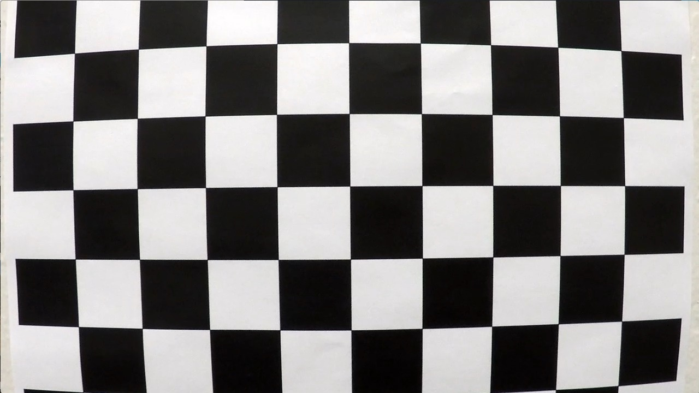 | 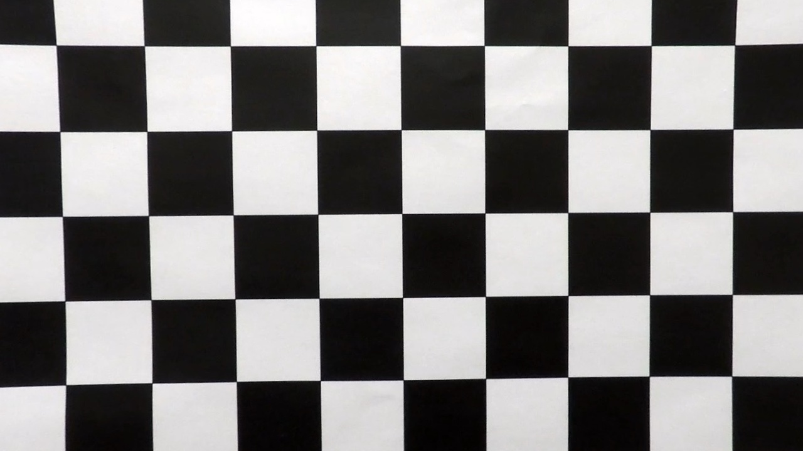 |


---
### Pipeline
The pipeline is done using the framework described above so every element in it inherit from ProcessStep and implement the needed methods.
<br>
The specific pipeline has several steps:
1. `grad_x`:
  1. Camera undistortion
  2. Grayscale
  3. Histograms equalization
  4. Gaussian blur
  5. Sobel in x axis
  6. Threshold (output a binary image)
2. `channel_s`
  1. Camera undistortion
  2. Convert color to HLS
  3. Select channel S
  4. Threshold (output a binary image)
3. `drivable_area`
  1. Combine `grad_x` and `channel_s` (grad_x or channel_s)
  2. Perspective transform to get bird eye view
  3. Find lane lines
  4. Convert binary to color image
  5. Clear the image and plot draw the road between the detected lane lines
  6. Undo the transform
4. `complete`
  1. Combine `drivable_area` with the initial image undistorted
  2. Put the text with the information of the curvature and the offset

The code for things that are specific to this project are in a file called *self_driving_car.py*.
In this file you can find the function that returns the just described pipeline:

```python
def pipeline():
    """
    Pipeline used in Udacity self-driving-car nanodegree.
    :return: Pipeline
    """
    import lane_lines_finder.steps as step

    # undistort + gradient in x(grayscale + hist_equalization + blur + grad_x) + thresholed
    grad_x = camera() + step.Grayscale.from_params() + step.HistogramEqualization() \
        + step.GaussianBlur(kernel_size=9) + step.AbsSobel(axis='x', kernel_size=3) + step.Threshold(min=50, max=255)
    # undistort + channel_s(convert_HLS + select_s) + thresholed
    channel_s = camera() \
        + step.ConvertColor(flag=cv2.COLOR_BGR2HLS) + step.SelectChannel(channel=2) + step.Threshold(min=170, max=255)
    # combine (grad_x and channel_s)
    combined = step.CombineBinary(pipelines=[grad_x, channel_s],
                                  function=lambda imgs, **kwargs: (imgs[0] == 1) | (imgs[1] == 1))

    def generate_polygon_points(img, **kwargs):
        """
        Functon to generate a poligon drawable by the function cv2.drawPoly
        :param img:
        :param kwargs: must contain 'lines_polynomial'
        :return: set of points, np.array
        """
        poly_l = kwargs['lines_polynomial'][0]
        poly_r = kwargs['lines_polynomial'][1]
        y = np.linspace(0, img.shape[0] - 1, img.shape[0]).astype(np.int)
        x_l = (poly_l[0] * y ** 2 + poly_l[1] * y + poly_l[2]).astype(np.int)
        x_r = (poly_r[0] * y ** 2 + poly_r[1] * y + poly_r[2]).astype(np.int)
        return np.vstack([np.vstack([x_l, y]).T, np.flipud(np.vstack([x_r, y]).T)])

    # extend(combined) + perspective + find lines + convert to color + draw the polygon + undo transform
    drivable_area = combined + perspective_transform() + find_lane_lines('image') \
        + step.Binary2Color(color=(255, 255, 255)) + step.ClearImage() \
        + step.FillPolygon(function=generate_polygon_points, color=(0, 255, 0)) \
        + perspective_transform(inverse=True)

    # combine(drivable_area and the input image) + put text with offset and curvature
    complete = step.CombineImages.from_params(pipelines=[camera(), drivable_area], weights=[1, 0.6]) \
        + step.DrawText(function=lambda img, **kwargs: 'Offset = ' + str(int(kwargs['offset_x']*100)/100.) + '    Curvature = ' + str(int(kwargs['curvature_radius'])),
                        color=(255,0,0), coordinates=(400, 680))
    return complete
```

---
### Steps in pipeline


#### Camera
This should be the first step in every pipeline if you want to work with undistorted images.
<br>
The calibration from a chessboard is done in one as part of the initialization, in the method `calibrate_from_chessboard(directory, pattern_size)`. After the initialization (calibrating the camera or loading a calibration), the method `undistort(img)` will undo the distortion introduced by the camera while taking the image.

```python
class Camera(ProcessStep):
    """
    It encapsulate the parameters of the camera and correct the distortion produced by the lens
    """
    def __init__(self, **kwargs):
        super().__init__(**kwargs)
        self.matrix = None
        self.distortion_coefficients = None
        self.calibrated = False
        if (kwargs.get('matrix') and kwargs.get('distortion_coefficients')) or (kwargs.get('directory') and kwargs.get('pattern_size')):
            self.setup(**kwargs)

    def setup(self, **kwargs):
        # It is possible to set it up directly with the parameters or computating the calibration
        if kwargs.get('matrix') and kwargs.get('distortion_coefficients'):
            self.matrix = kwargs['matrix']
            self.distortion_coefficients = kwargs['distortion_coefficients']
            self.calibrated = True
        elif kwargs.get('directory') and kwargs.get('pattern_size'):
            self.calibrate(kwargs['directory'], kwargs['pattern_size'])

    def process(self, img=None, **kwargs):
        # Undistort the image
        return self.undistort(img), kwargs

    def dump_calibration(self, file):
        """
        Dump the calibration parameters
        :param file: path where to dump the parameters
        :return: bool, depending if the dump could be done
        """
        if self.calibrated:
            with open(file, 'wb') as f:
                pickle.dump({'matrix': self.matrix, 'distortion_coefficients': self.distortion_coefficients}, f)
                return True
        else:
            print('Camera no calibrated. Calibration dump canceled.')
        return False

    def load_calibration(self, file):
        """
        Load the calibration parameters from a file.
        :param file: path to the file with the dumped configuration parameters
        :return: True if the file was found and it contains the parameters, False otherwise
        """
        try:
            with open(file, 'rb') as f:
                cal = pickle.load(f)
                self.matrix = cal['matrix']
                self.distortion_coefficients = cal['distortion_coefficients']
                self.calibrated = True
                print(f'Camera calibrated from file "{file}".')
                return True
        except FileNotFoundError:
            print(f'File "{file}" not found.')
            return False
        except KeyError:
            print(f'File "{file}" is not a saved calibration.')
            return False

    def calibrate_from_chessboard(self, directory, pattern_size):
        """
        Calibrate the camera parameters using chessboard patterns.
        :param directory: path to the directory containing the images of the chessboard
        :param pattern_size: number of vertices inside the chessboard
        :return: True if the camera is successfully calibrated, False otherwise
        """
        # Prepare object points, like (0,0,0), (1,0,0), (2,0,0) ....,(6,5,0) defining the points detected in the chessboard
        obj_points_prototype = np.zeros((pattern_size[1] * pattern_size[0], 3), np.float32)
        obj_points_prototype[:, :2] = np.mgrid[0:pattern_size[0], 0:pattern_size[1]].T.reshape(-1, 2)

        # Arrays to store object points and image points from all the images.
        obj_points = []  # 3d points in real world space
        img_points = []  # 2d points in image plane.

        # All the images for calibration must have the same size
        img_size = None

        # Count of the number of images
        n_img = 0

        # Step through the list and search for chessboard corners
        for idx, file in enumerate(pathlib.Path(directory).iterdir()):
            # Get the absolute path
            file = str(file.resolve())

            # Read the image
            img = cv2.imread(file)
            if img is None:  # the file is not an image
                continue

            # Convert to grayscale
            gray = cv2.cvtColor(img, cv2.COLOR_BGR2GRAY)

            # Find the chessboard corners
            ret, corners = cv2.findChessboardCorners(gray, pattern_size, None)

            # If found, add object points, image points
            if ret:
                # Increment the count
                n_img += 1
                # Save the size of the first image
                if not img_size:
                    img_size = (img.shape[1], img.shape[0])
                # Check all the images have the same size, raise an exception if they are not
                elif abs(img_size[0] - img.shape[1]) > 10 or abs(img_size[1] - img.shape[0]) > 10:
                    raise UserWarning('All the images must have the same size (height, width).')

                # refining pixel coordinates for given 2d points.
                # cv2.cornerSubPix(image, corners, window_size, zero_zone, criteria)
                corners = cv2.cornerSubPix(gray, corners, (11, 11), (-1, -1), (cv2.TERM_CRITERIA_EPS + cv2.TERM_CRITERIA_MAX_ITER, 30, 0.001))

                # Append the objects to the calibration matrices
                obj_points.append(obj_points_prototype)
                img_points.append(corners)
        # Around 20 images is a good number, less than 5 the calibration can not be good
        if n_img >= 5:
            # Do camera calibration given object points and image points
            _, mtx, dist, _, _ = cv2.calibrateCamera(obj_points, img_points, img_size, None, None)

            self.calibrated = True
            self.matrix = mtx
            self.distortion_coefficients = dist
            return True
        else:
            print('The directory does not have enough images, 5 or more images are required.')
            return False

    def calibrate(self, directory, pattern_size):
        """
        General method to calibrate a camera.
        It will look for dumped parameters and calibrate from chessboard if the dumped file is not found.
        :param directory: directory to look for everything
        :param pattern_size: to use if a dump file is not found
        :return: True if the camera have been calibrated, False otherwise
        """
        directory = pathlib.Path(directory).resolve()
        # look for dumped file in the directory and load it if it exist
        for p in directory.glob('*.p'):
            if self.load_calibration(str(p)):
                return True
        # calibrate from chessboard
        self.calibrate_from_chessboard(directory, pattern_size)
        # save the calibration parameters
        self.dump_calibration(pathlib.Path(directory).joinpath('calibration.p').resolve())
        return self.calibrated

    def undistort(self, img):
        # undo the distortion
        return cv2.undistort(img, self.matrix, self.distortion_coefficients)  #, None, mtx)
```
An example of distorted and undistorted images is:
<br>

| Before       | After     |
|:---------------:|:---------------:|
|  | 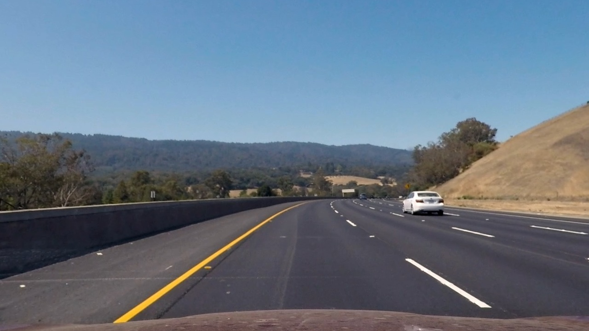 |


#### Grayscale
Covnert to gray scale.

```python
class Grayscale(ProcessStep):
    def __init__(self, **kwargs):
        super().__init__(**kwargs)
        self.flag = cv2.COLOR_BGR2GRAY
        if 'flag' in kwargs:
            self.setup(**kwargs)

    def setup(self, **kwargs):
        self.flag = kwargs['flag']
        self.ready()

    @classmethod
    def from_params(cls, flag=cv2.COLOR_BGR2GRAY):
        return cls(flag=flag)

    def process(self, img=None, **kwargs):
        self.check_ready()
        return cv2.cvtColor(img, self.flag), kwargs
```
An example is:
<br>

| Before       | After     |
|:---------------:|:---------------:|
|  | 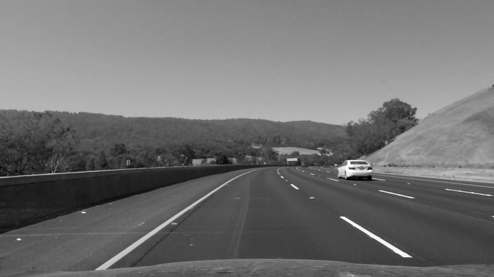 |


#### HistogramEqualization
Redistribute the value of the pixels to make the histogram plane.

```python
class HistogramEqualization(ProcessStep):
    def __init__(self, **kwargs):
        super().__init__(**kwargs)
        self.setup(**kwargs)

    def setup(self, **kwargs):
        self.ready()

    @classmethod
    def from_params(cls):
        return cls()

    def process(self, img=None, **kwargs):
        self.check_ready()
        image = np.copy(img)
        if len(img.shape) < 3:
            image[:, :] = cv2.equalizeHist(img[:, :])
        else:
            for channel in img.shape[2]:
                image[:, :, channel] = cv2.equalizeHist(img[:, :, channel])
        return image, kwargs
```
An example is:
<br>

| Before       | After     |
|:---------------:|:---------------:|
|  | 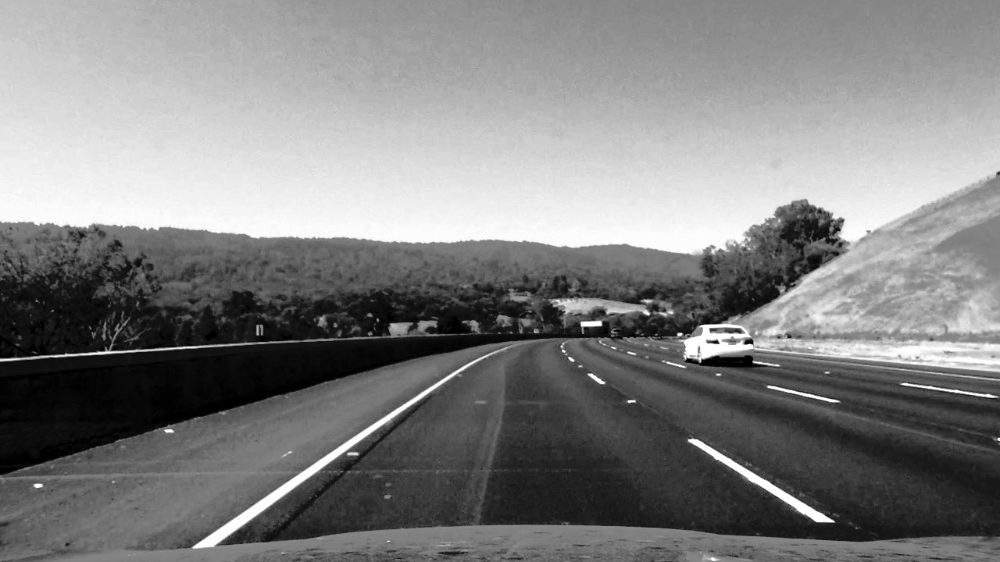 |


#### GaussianBlur
Calculate la convolution with a Gaussian kernel.

```python
class GaussianBlur(ProcessStep):
    def __init__(self, **kwargs):
        super().__init__(**kwargs)
        self.kernel_size = 5
        if 'kernel_size' in kwargs:
            self.setup(**kwargs)

    def setup(self, **kwargs):
        self.kernel_size = kwargs['kernel_size']
        self.ready()

    @classmethod
    def from_params(cls, kernel_size):
        return cls(kernel_size=kernel_size)

    def process(self, img=None, **kwargs):
        self.check_ready()
        return cv2.GaussianBlur(img, (self.kernel_size, self.kernel_size), 0), kwargs
```
In this project `kernel_size=9` for `grad_x`.
<br>
An example is:
<br>

| Before       | After     |
|:---------------:|:---------------:|
|  | 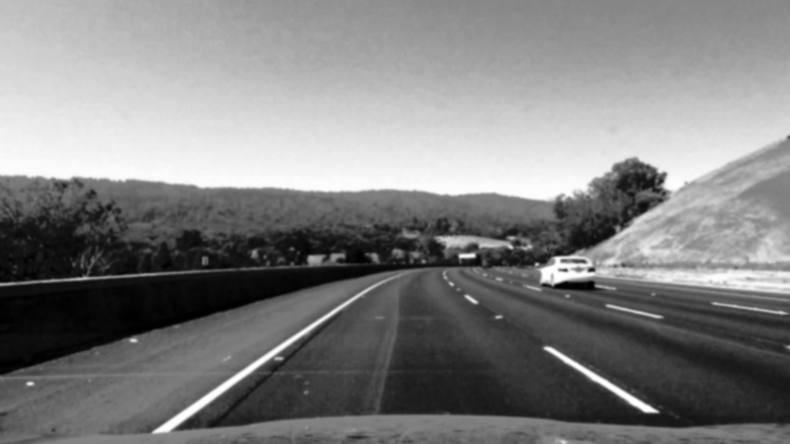 |


#### AbsSobel
Calculate the convolution with a Sobel kernel.

```python
class AbsSobel(ProcessStep):
    def __init__(self, **kwargs):
        super().__init__(**kwargs)
        self.axis = None
        self.kernel_size = 0
        if 'axis' in kwargs and 'kernel_size' in kwargs:
            self.setup(**kwargs)

    def setup(self, **kwargs):
        if kwargs['axis'] not in ['x', 'y']:
            raise ValueError('Axis for Sobel must be "x" or "y".')
        self.axis = (1, 0) if kwargs['axis'] == 'x' else (0, 1)
        self.kernel_size = kwargs['kernel_size']
        self.ready()

    @classmethod
    def from_params(cls, axis, kernel_size):
        return cls(axis=axis, kernel_size=kernel_size)

    def process(self, img=None, **kwargs):
        self.check_ready()
        sobel = cv2.Sobel(img, cv2.CV_64F, self.axis[0], self.axis[1], ksize=self.kernel_size)
        abs_sobel = np.absolute(sobel)
        abs_sobel_8u = np.uint8(255 * abs_sobel / np.max(abs_sobel))
        return abs_sobel_8u, kwargs
```
In this project `axis='x', kernel_size=3` for `grad_x`.
<br>
An example is:
<br>

| Before       | After     |
|:---------------:|:---------------:|
|  | 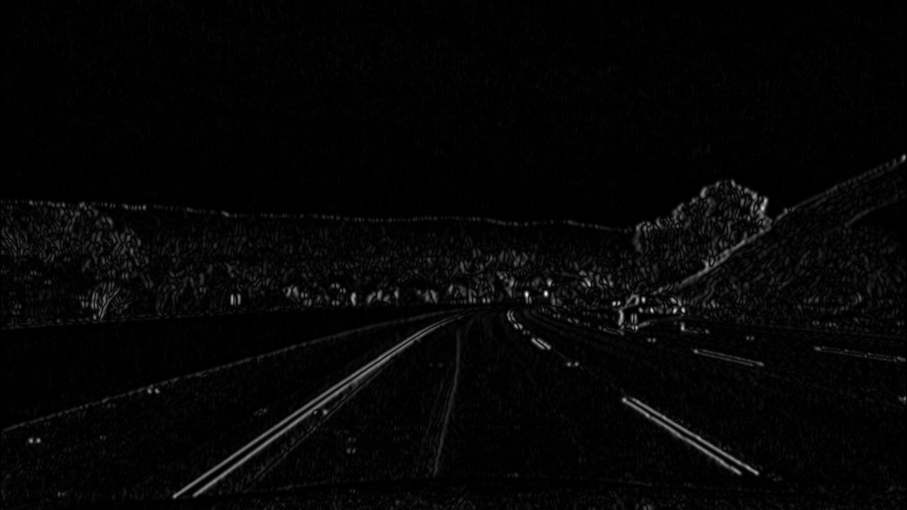 |


#### Threshold
The output is a binary image. Only the pixels between the minimum and the maximum threshold will be high.

```python
class Threshold(ProcessStep):
    """
    :param img: 2D np.array with values between 0 and 255
    :param thresholds: (min, max)
    :return: 2D binary np.array with the same shape than the input, with 1s where the pixel is between the thresholds
    """
    def __init__(self, **kwargs):
        super().__init__(**kwargs)
        self.min = None
        self.max = None
        if 'min' in kwargs and 'max' in kwargs:
            self.setup(**kwargs)

    def setup(self, **kwargs):
        self.min = kwargs['min']
        self.max = kwargs['max']
        self.ready()

    @classmethod
    def from_params(cls, min_thres, max_thres):
        return cls(min=min_thres, max=max_thres)

    def process(self, img=None, **kwargs):
        self.check_ready()
        out = np.zeros_like(img)
        out[(img >= self.min) & (img <= self.max)] = 1
        return out, kwargs
```
In this project `min=50, max=255` for `grad_x` and `min=170, max=255` for `channel_s`.
<br>
An example is:
<br>

| Before       | After     |
|:---------------:|:---------------:|
|  | 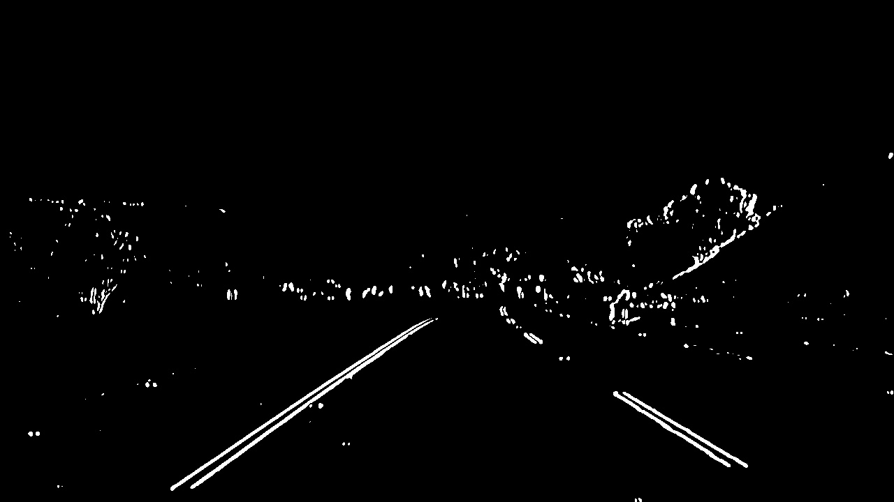 |


#### ConvertColor
Convert between different colour schemes.

```python
class ConvertColor(ProcessStep):
    def __init__(self, **kwargs):
        super().__init__(**kwargs)
        self.flag = None
        if 'flag' in kwargs:
            self.setup(**kwargs)

    def setup(self, **kwargs):
        self.flag = kwargs['flag']
        self.ready()

    @classmethod
    def from_params(cls, flag):
        return cls(flag=flag)

    def process(self, img=None, **kwargs):
        self.check_ready()
        return cv2.cvtColor(img, self.flag), kwargs
```
In this project `flag=cv2.COLOR_BGR2HLS` for `channel_s`.
<br>
An example is:
<br>

| Before       | After     |
|:---------------:|:---------------:|
|  | 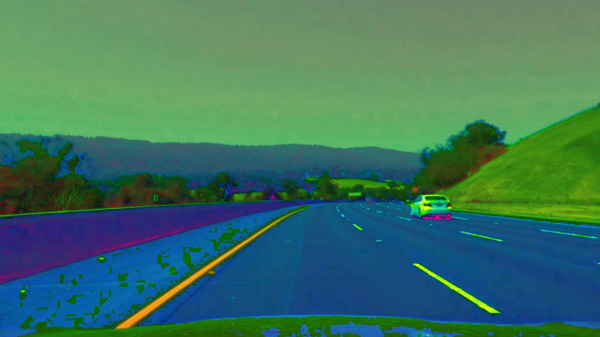 |


#### SelectChannel
Select one channel from a multiple channel image.

```python
class SelectChannel(ProcessStep):
    def __init__(self, **kwargs):
        super().__init__(**kwargs)
        self.channel = None
        if 'channel' in kwargs:
            self.setup(**kwargs)

    def setup(self, **kwargs):
        self.channel = kwargs['channel']
        self.ready()

    @classmethod
    def from_params(cls, channel):
        return cls(channel=channel)

    def process(self, img=None, **kwargs):
        self.check_ready()
        return img[:, :, self.channel], kwargs
```
In this project `channel=2` for `channel_s`.
<br>
An example is:
<br>

| Before       | After     |
|:---------------:|:---------------:|
|  | 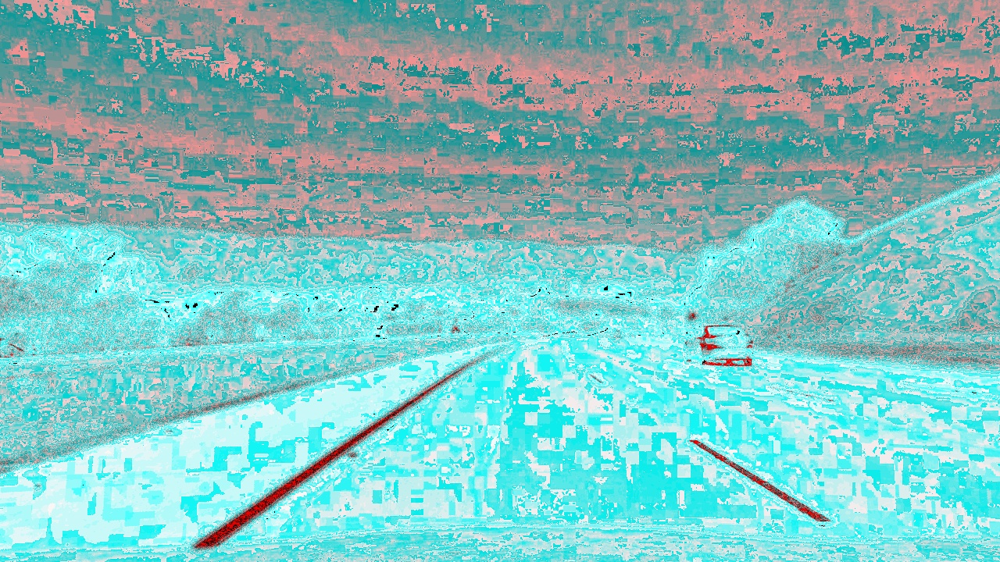 |


#### CombineBinary
Combine two binary images. The output is a binary image combined in the way described by the function provided.

```python
class CombineBinary(ProcessStep):
    def __init__(self, **kwargs):
        super().__init__(**kwargs)
        self.pipelines = None
        self.function = None  # combine the output of the different pipelines
        if 'function' in kwargs and 'pipelines' in kwargs:
            self.setup(**kwargs)

    def setup(self, **kwargs):
        self.pipelines = kwargs['pipelines']
        self.function = kwargs['function']
        self.ready()

    @classmethod
    def from_params(cls, combining_function):
        return cls(function=combining_function)

    def process(self, img=None, **kwargs):
        self.check_ready()
        images = []
        for pip in self.pipelines:
            # TODO consider merging conflicts between kwargs from different pipelines
            image, kwargs = pip.process(img, **kwargs)
            images.append(image)
        combined = np.zeros_like(img[:,:,0])
        combined[self.function(images, **kwargs)] = 1
        return combined, kwargs
```
In this project `pipelines=[grad_x, channel_s], function=lambda imgs, **kwargs: (imgs[0] == 1) | (imgs[1] == 1)` for `combined`. It is just an or function with two binary images.
<br>
An example is:
<br>

| Before 1      | Before 2     | After     |
|:---------------:|:---------------:|:---------------:|
| 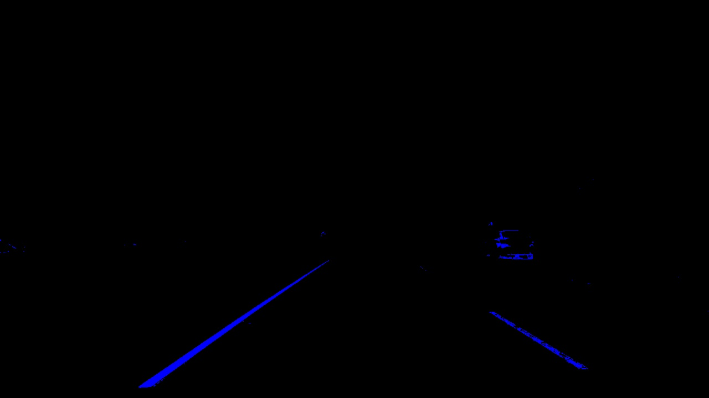 | 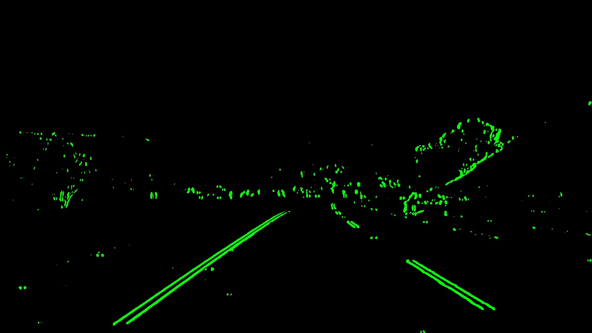 | 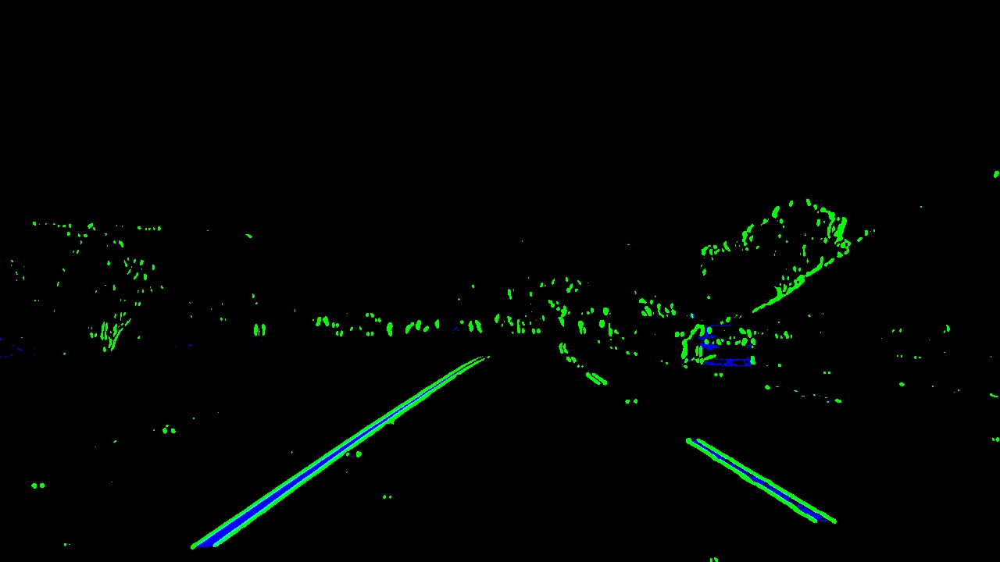 |


#### PerspectiveTransform
This step performs a transformation in the perspective of the image.
<br>
To calculate the matrix transform two sets of points are needed, one representing the source in the input image and the other set of points represent the destination in the output image. For the case of a self driving car, the source points are chosen in a way that we know  they are a rectangle in the real world.
<br>
In this case, points centred in the image(the camera is supposed to be centred in the car) and parallel to straight lane lines. The chosen points are:
```python
def transform_points():
    """
    Points used in Udacity self-driving-car nanodegree for the transform
    :return: (src_points, dst_points) as np.array
    """

    src_points = np.float32([[200, 720], [580, 460], [700, 460], [1080, 720]])  # from middle to the bottom image centred
    dst_points = np.float32([[280, 720], [280, 0], [1000, 0], [1000, 720]])  # from middle to the bottom image centred
    return src_points, dst_points
```
These images demonstrate the transformation(red lines join the points that describe the transformation):
<br>

| Before       | After     |
|:---------------:|:---------------:|
| 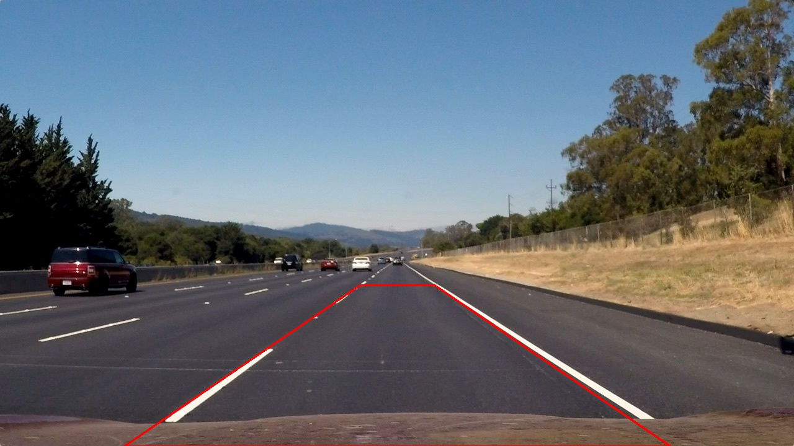 | 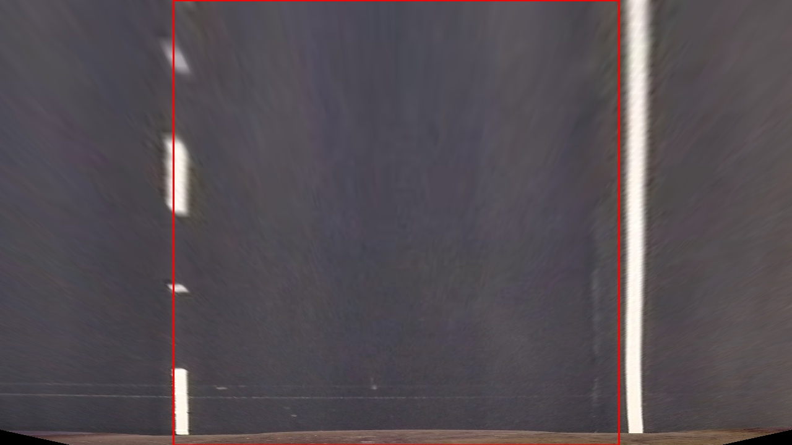 |

The code that perform the transform is:

```python
class PerspectiveTransform(ProcessStep):
    """
    Given a set of input points and output points it calculates the correspondent transform
    and it is able to produce that transform in images.
    """
    def __init__(self, **kwargs):
        super().__init__(**kwargs)
        # self.source_points = None
        # self.destination_points = None
        self.matrix = None
        self.matrix_inverse = None
        self.inverse = None
        if kwargs.get('source_points') is not None and kwargs.get('destination_points') is not None:
            self.setup(**kwargs)

    def setup(self, **kwargs):
        # calculate the matrix and the inverse matrix of the transform
        self.matrix = cv2.getPerspectiveTransform(kwargs['source_points'], kwargs['destination_points'])
        self.matrix_inverse = cv2.getPerspectiveTransform(kwargs['destination_points'], kwargs['source_points'])
        # True to undo the transform
        self.inverse = kwargs['inverse']

    @classmethod
    def from_params(cls, source_points, destination_points, inverse=False):
        return cls(source_points=source_points, destination_points=destination_points, inverse=inverse)

    def process(self, img=None, **kwargs):
        if self.inverse:
            return self.undo_transform(img), kwargs
        else:
            return self.transform(img), kwargs

    def transform(self, img):
        return cv2.warpPerspective(img, self.matrix, (img.shape[1], img.shape[0]), flags=cv2.INTER_LINEAR)

    def undo_transform(self, img):
        return cv2.warpPerspective(img, self.matrix_inverse, (img.shape[1], img.shape[0]), flags=cv2.INTER_LINEAR)
```
In this project it is used to transform and to undo the transform later.
<br>
An example of retriving the original prespective is:
<br>

| Before       | After     |
|:---------------:|:---------------:|
| 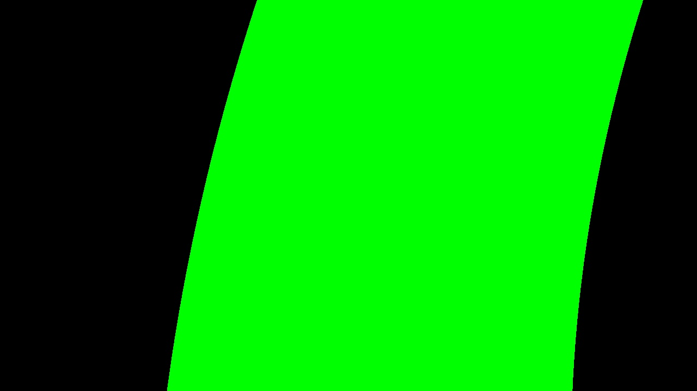 | 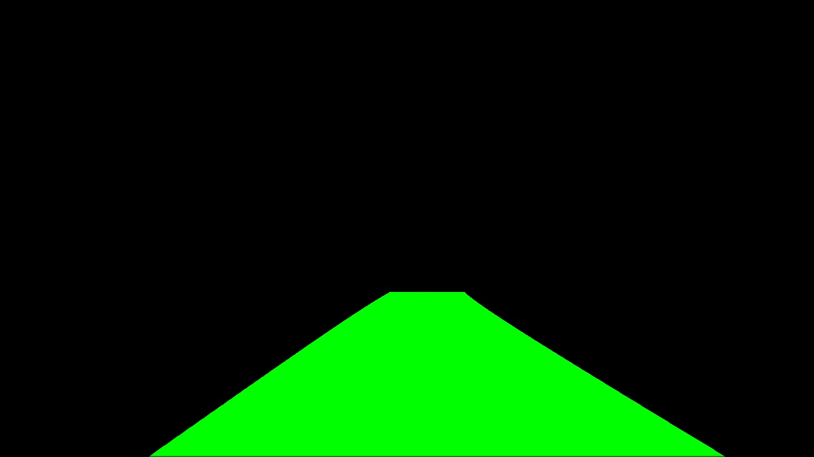 |


#### FindLaneLines
Find lane lines in binary bird eye view images. If it is processing images it will always perform sliding window, in the case it is processing video, it will use sliding window only when the lines where not find previously. In video, after a detection with sliding window it will just look for lines in the surroundings of the previously detected lane lines. It saves few lines detections and combine them using a weighted average, the older a line is the lighter is its weight. It does as well the calculation of the offset of the car and the curvature of the road. For a simple idea of how it works check `Line.best, FindLines.process, FindLines.sliding_window, FindLines.detection, FindLines.measure_curvature, FindLines.measure_offset_x`.

```python
class Window:
    """
    Keeps the calculations done by the sliding window
    """
    def __init__(self, width=None, heigth=None):
        self._x_range = [0, 0]
        self._y_range = [0, 0]
        if width and heigth:
            self.set_size(width, heigth)

    def set_size(self, width=None, heigth=None):
        if width is not None:
            x_mid = (self._x_range[0] + self._x_range[1]) / 2
            self._x_range = [x_mid - width / 2, x_mid + width / 2]
        if heigth is not None:
            y_mid = (self._y_range[0] + self._y_range[1]) / 2
            self._y_range = [y_mid-heigth/2, y_mid+heigth/2]

    def get_size(self):
        width = self._x_range[1] - self._x_range[0]
        heigth = self._y_range[1] - self._y_range[0]
        return width, heigth

    def set_center(self, x=None, y=None):
        width, heigth = self.get_size()
        if x is not None:
            self._x_range = [x - width / 2, x + width / 2]
        if y is not None:
            self._y_range = [y-heigth/2, y+heigth/2]

    def get_center(self, p):
        x_mid = (self._x_range[0] + self._x_range[1]) / 2
        y_mid = (self._y_range[0] + self._y_range[1]) / 2
        return x_mid, y_mid

    def set_base_center(self, x=None, y=None):
        width, heigth = self.get_size()
        if x is not None:
            self._x_range = [x - width / 2, x + width / 2]
        if y is not None:
            # the base has bigger y coordinate
            self._y_range = [y-heigth, y]

    def move(self, x=None, y=None):
        if x is not None:
            self._x_range = [c+x for c in self._x_range]
        if y is not None:
            self._y_range = [c+y for c in self._y_range]

    def get_rectangle(self):
        return (self._x_range[0], self._y_range[0]), (self._x_range[1], self._y_range[1])

    def inner_nonzero_pixels(self, img):
        """
        :param img:
        :return: np.array with the coordinates of the white points in the window
        """
        # Identify the x and y positions of all non_zero pixels in the image
        non_zero = img.nonzero()
        non_zero_y = np.array(non_zero[0])
        non_zero_x = np.array(non_zero[1])
        valid_non_zero_ind = ((non_zero_x >= self._x_range[0]) & (non_zero_x < self._x_range[1]) &
                          (non_zero_y >= self._y_range[0]) & (non_zero_y < self._y_range[1])).nonzero()[0]
        return list(np.vstack((non_zero_x[valid_non_zero_ind], non_zero_y[valid_non_zero_ind])).T)


class Line:
    """
    Encapsulates the calculations done to integrate various lines.
    """
    def __init__(self, size):
        self.size = size
        # number of valid lines
        self.valid_lines = 0
        # was the line detected
        self.detected = np.array([False]*size)
        # polynomial coefficients
        self.poly = np.array([np.array([0,0,0])]*size)

    def last_detected(self):
        d = self.detected[0] if self.valid_lines else False
        return d

    def add(self, poly, detected):
        self.valid_lines = self.valid_lines + 1 if self.valid_lines < self.size else self.size
        self.detected = np.hstack([detected, self.detected[:-1]])
        self.poly = np.vstack([poly, self.poly[:-1]])

    def best(self):
        """
        Calculate the best estimation of the line given all the information it has.
        It implements a weighted average, the older a line is the lighter is its weight.
        :return:
        """
        t = 0
        poly = np.zeros_like(self.poly[0])
        for i in range(self.valid_lines):
            forget_parameter = self.size - i
            if self.detected[i]:
                poly += forget_parameter * self.poly[i]
                t += forget_parameter
        poly = poly / t
        # poly = np.mean(self.poly[:self.valid_lines][self.detected[:self.valid_lines]], axis=0)
        return poly

    @classmethod
    def combine(cls, l1, l2):
        """
        Combine two lines and return two parallel lines.
        :param l1:
        :param l2:
        :return:
        """
        p1 = l1.best()
        p2 = l2.best()

        p = np.mean([p1, p2], axis=0)

        x1_b = p1[0] * 720**2 + p1[1] * 720 + p1[2]
        x2_b = p2[0] * 720**2 + p2[1] * 720 + p2[2]
        x_b = p[0] * 720**2 + p[1] * 720 + p[2]

        return np.array([p[0], p[1], p[2]-(x_b-x1_b)]), np.array([p[0], p[1], p[2]+(x2_b-x_b)])


class FindLines(ProcessStep):
    """
    Find lane lines in binary bird eye view images.
    """
    def __init__(self, **kwargs):
        super().__init__(**kwargs)
        # parameters of the sliding window
        self.window_number = 0  # 9 number of sliding windows
        self.window_width = 0  # 100 width of the windows +/- margin
        self.window_min_n_pixels = 0  # 50 minimum number of pixels found to recenter window
        # parameters to look for a line arround a previous line
        self.search_width = 0
        # conversion between pixels and meters
        self.pixels_to_meters = (0, 0)
        # store the last lines
        self.history_len = 0
        self.lines = None
        if 'window_number' in kwargs and 'window_width' in kwargs and 'window_min_n_pixels' in kwargs \
                and 'search_width' in kwargs and 'pixels_to_meters' in kwargs and 'history_len' in kwargs:
            self.setup(**kwargs)

    def setup(self, **kwargs):
        self.window_number = kwargs['window_number']
        self.window_width = kwargs['window_width']
        self.window_min_n_pixels = kwargs['window_min_n_pixels']
        self.search_width = kwargs['search_width']
        self.pixels_to_meters = kwargs['pixels_to_meters']
        self.history_len = kwargs['history_len']
        self.lines = (Line(self.history_len), Line(self.history_len))
        self.ready()


    @classmethod
    def from_params(cls, window_number, window_width, window_min_n_pixels, search_width, pixels_to_meters, history_len):
        return cls(window_number=window_number, window_margin=window_width, window_min_n_pixels=window_min_n_pixels,
                   pixels_to_meters=pixels_to_meters, history_len=history_len)

    def process(self, img=None, **kwargs):
        self.check_ready()
        # it is going to process connected images(video) or disconnected images(image)
        if kwargs['type'] == 'image':
            polys, line_points = self.first_detection(img)
        else:  # if kwargs['type'] == 'video':
            if not (self.lines[0].last_detected() and self.lines[1].last_detected()):
                polys, line_points = self.first_detection(img)
            else:
                polys, line_points = self.detection(img)
            # security checks
            detected = self.check_lines(polys)
            # add them to the lines
            self.lines[0].add(polys[0], detected)
            self.lines[1].add(polys[1], detected)
            polys = (self.lines[0].best(), self.lines[1].best())
            # polys = Line.combine(self.lines[0], self.lines[1])

        # the offset to the centre of the road in meters
        offset_x = self.measure_offset_x(img, polys[0], polys[1])
        # Curvature of the road in m
        # we suppose lines are parallels
        av_poly = np.mean([polys[0], polys[1]], axis=0)
        # calculate the curvature on the bottom of the image
        radius = self.measure_curvature(av_poly, img.shape[0]-1)

        # save the output for the pipeline
        kwargs['lines_polynomial'] = [polys[0], polys[1]]
        kwargs['lines_points'] = [line_points[0], line_points[1]]
        kwargs['offset_x'] = offset_x
        kwargs['curvature_radius'] = radius
        return img, kwargs

    def check_lines(self, polys):
        # check curvature is similar
        c_l = self.measure_curvature(polys[0], 719)
        c_r = self.measure_curvature(polys[1], 719)
        if np.absolute(c_l - c_r) > 1*(c_l + c_r)/2:
            # lines do not have similar curvature
            return False

        # check distance between lines and parallelisms
        ys = [300, 500, 700]
        dist = []
        for y in ys:
            x_l = polys[0][0] * y**2 + polys[0][1] * y + polys[0][2]
            x_r = polys[1][0] * y**2 + polys[1][1] * y + polys[1][2]
            diff_m = np.absolute(x_r - x_l) * self.pixels_to_meters[0]
            if np.absolute(diff_m - 3.7) > 3:
                # Lines are not separated more or less 3.7 m
                return False
            dist.append(diff_m)
        if np.any(np.absolute(np.array(dist)-np.mean(dist)) > 1*np.mean(dist)):
            # distances in the three points arent similar
            return False
        return True

    def detection(self, img):
        # Grab activated pixels
        nonzero = img.nonzero()
        nonzeroy = np.array(nonzero[0])
        nonzerox = np.array(nonzero[1])

        # generate the points in the lines
        poly_l = self.lines[0].best()
        poly_r = self.lines[1].best()
        y = np.linspace(0, img.shape[0] - 1, img.shape[0])
        x_l = poly_l[0] * y**2 + poly_l[1] * y + poly_l[2]
        x_r = poly_r[0] * y**2 + poly_r[1] * y + poly_r[2]

        # retrive the last poly
        left_fit = self.lines[0].best()
        right_fit = self.lines[1].best()
        # for every nonzero y calculate the correspond x in the polinomial function,
        # add the margin and the if the correspondent x in the nonzero x is within the margins
        left_lane_inds = ((nonzerox > (left_fit[0] * (nonzeroy ** 2) + left_fit[1] * nonzeroy + left_fit[2] - self.search_width))
                          & (nonzerox < (left_fit[0] * (nonzeroy ** 2) + left_fit[1] * nonzeroy + left_fit[2] + self.search_width)))
        right_lane_inds = ((nonzerox > (right_fit[0] * (nonzeroy ** 2) + right_fit[1] * nonzeroy + right_fit[2] - self.search_width))
                           & (nonzerox < (right_fit[0] * (nonzeroy ** 2) + right_fit[1] * nonzeroy + right_fit[2] + self.search_width)))

        # Again, extract left and right line pixel positions
        leftx = nonzerox[left_lane_inds]
        lefty = nonzeroy[left_lane_inds]
        line_l_points = np.array([nonzerox[left_lane_inds], nonzeroy[left_lane_inds]]).T
        rightx = nonzerox[right_lane_inds]
        righty = nonzeroy[right_lane_inds]
        line_r_points = np.array([nonzerox[right_lane_inds], nonzeroy[right_lane_inds]]).T

        # Fit new polynomials
        poly_l = self.fit_poly(line_l_points)
        poly_r = self.fit_poly(line_r_points)

        return (poly_l, poly_r), (line_l_points, line_r_points)

    def first_detection(self, img):
        line_l_points, line_r_points = self.sliding_window(img)
        if line_r_points.size and line_l_points.size:
            poly_l = self.fit_poly(line_l_points)
            poly_r = self.fit_poly(line_r_points)
            return (poly_l, poly_r), (line_l_points, line_r_points)
        else:

            return (np.array([0,0,0]), np.array([0,0,0])), (line_l_points, line_r_points)

    def sliding_window(self, img):
        win_l = Window(width=self.window_width, heigth=img.shape[0]/self.window_number)
        win_r = Window(width=self.window_width, heigth=img.shape[0]/self.window_number)

        # Set initial position
        win_l_x_centre, win_r_x_centre = self.find_hist_bottom_peaks(img)
        win_l.set_base_center(win_l_x_centre, img.shape[0]-1)
        win_r.set_base_center(win_r_x_centre, img.shape[0]-1)

        # To save the points owned by each line
        line_l_points = []
        line_r_points = []

        for i in range(self.window_number):
            # Get valid points within the windows
            l_points = win_l.inner_nonzero_pixels(img)
            r_points = win_r.inner_nonzero_pixels(img)

            # Save those points
            line_l_points += l_points
            line_r_points += r_points

            # If there are more points than the minimum, modify the position of the window
            if len(l_points) >= self.window_min_n_pixels:
                new_x = np.int(np.mean(np.array(l_points)[:,0]))
                win_l.set_base_center(x=new_x)
            if len(r_points) >= self.window_min_n_pixels:
                new_x = np.int(np.mean(np.array(r_points)[:,0]))
                win_r.set_base_center(x=new_x)
            win_l.move(y=-win_l.get_size()[1])
            win_r.move(y=-win_r.get_size()[1])

        return np.array(line_l_points), np.array(line_r_points)

    def fit_poly(self, points):
        # generate a second order polynomial to fit the points
        # It is a polynomial of the form x = a*y**2 + b*y + c
        # x is used a dependent variable because almost vertical lines are expected
        return np.polyfit(points[:,1], points[:,0], 2)

    def measure_curvature(self, poly, y):
        """
        Calculates the curvature of polynomial functions in meters.
        :param poly:
        :param y:
        :return:
        """
        a = (self.pixels_to_meters[0]/self.pixels_to_meters[1]**2)*poly[0]
        b = (self.pixels_to_meters[0]/self.pixels_to_meters[1])*poly[1]
        radius = ((1 + (2 * a * y + b) ** 2) ** 1.5) / np.absolute(2 * a)
        return radius

    def measure_offset_x(self, img, poly_l, poly_r):
        """
        Return the offset of the car in the x axis referenced to the center of the road in meter
        :param img:
        :param poly_l:
        :param poly_r:
        :return:
        """
        y = img.shape[0]    # we are going to calculate the x value on the bottom of the image
        x_l = poly_l[0] * y**2 + poly_l[1] * y + poly_l[2]
        x_r = poly_r[0] * y**2 + poly_r[1] * y + poly_r[2]
        middle_road = (x_l + x_r) / 2
        diff = np.absolute(middle_road - img.shape[1]/2)
        return self.pixels_to_meters[0] * diff

    def find_hist_bottom_peaks(self, img):
        # Grab only the bottom half of the image
        # Lane lines are likely to be mostly vertical nearest to the car
        bottom_half = img[img.shape[0] // 2:, :]

        # Sum across image pixels vertically - make sure to set an `axis`
        # i.e. the highest areas of vertical lines should be larger values
        histogram = np.sum(bottom_half, axis=0)

        # Find the peak of the left and right halves of the histogram
        # These will be the starting point for the left and right lines
        midpoint = np.int(histogram.shape[0] // 2)
        leftx_base = np.argmax(histogram[:midpoint])
        rightx_base = np.argmax(histogram[midpoint:]) + midpoint

        return leftx_base, rightx_base
```
In this project `window_number=10, window_width=150, window_min_n_pixels=50, search_width=150,
                     pixels_to_meters=pixels_to_meters(), history_len=25`.
<br>
An example is:
<br>

| Before       | After     |
|:---------------:|:---------------:|
| 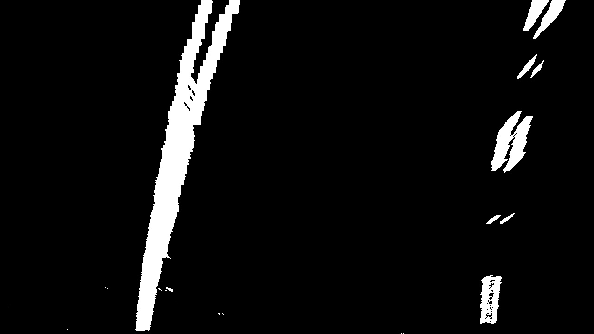 | 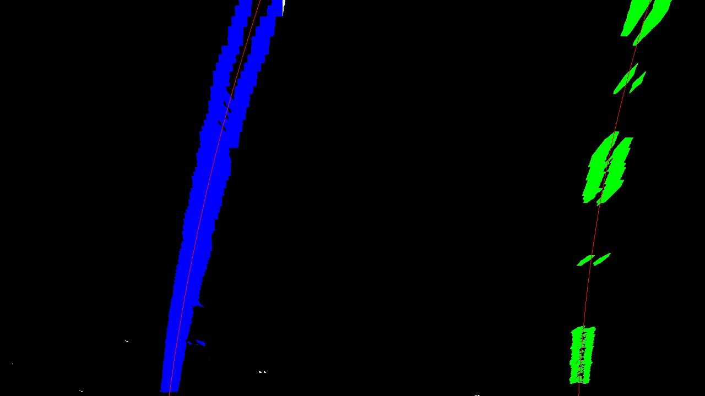 |


#### Binary2Color
It creates a coloured image from a binary one.

```python
class Binary2Color(ProcessStep):
    def __init__(self, **kwargs):
        super().__init__(**kwargs)
        self.color = (255, 255, 255)
        if 'color' in kwargs:
            self.setup(**kwargs)

    def setup(self, **kwargs):
        self.color = kwargs['color']
        self.ready()

    @classmethod
    def from_params(cls, color=(255, 255, 255)):
        return cls(color=color)

    def process(self, img=None, **kwargs):
        self.check_ready()
        return np.dstack((img*self.color[0], img*self.color[1], img*self.color[2])), kwargs
```
An example is:
<br>

| Before      | After     |
|:---------------:|:---------------:|
| 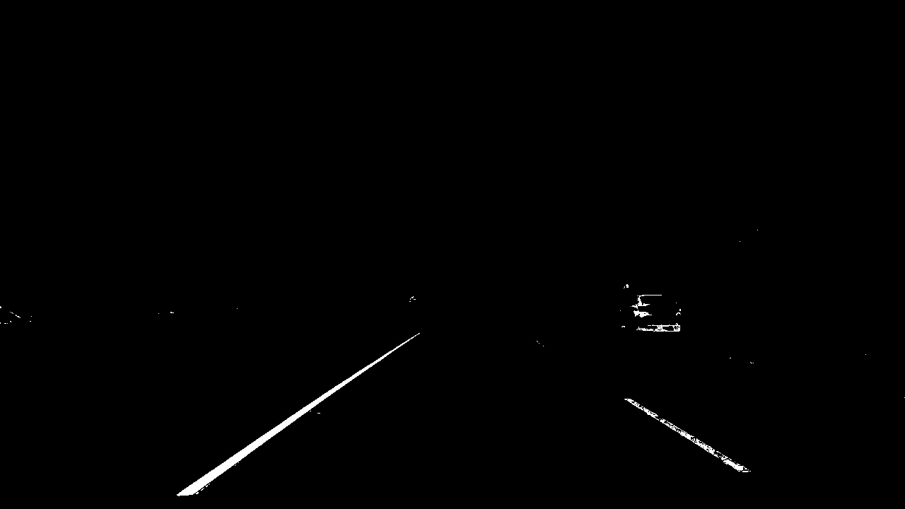 |  |


#### FillPolygon
Fill a polygon with a given color.

```python
class FillPolygon(ProcessStep):
    def __init__(self, **kwargs):
        super().__init__(**kwargs)
        self.function = None
        self.color = None
        if 'function' in kwargs and 'color' in kwargs:
            self.setup(**kwargs)

    def setup(self, **kwargs):
        self.function = kwargs['function']
        self.color = kwargs['color']
        self.ready()

    @classmethod
    def from_params(cls, function, color):
        return cls(function=function, color=color)

    def process(self, img=None, **kwargs):
        self.check_ready()
        points = self.function(img, **kwargs)
        cv2.fillPoly(img, np.int_([points]), self.color)
        #cv2.fillConvexPoly(img, points, self.color)
        return img, kwargs
```
In this project `function=generate_polygon_points, color=(0, 255, 0)` and `generate_polygon_points` is:
```python
def generate_polygon_points(img, **kwargs):
    """
    Functon to generate a poligon drawable by the function cv2.drawPoly
    :param img:
    :param kwargs: must contain 'lines_polynomial'
    :return: set of points, np.array
    """
    poly_l = kwargs['lines_polynomial'][0]
    poly_r = kwargs['lines_polynomial'][1]
    y = np.linspace(0, img.shape[0] - 1, img.shape[0]).astype(np.int)
    x_l = (poly_l[0] * y ** 2 + poly_l[1] * y + poly_l[2]).astype(np.int)
    x_r = (poly_r[0] * y ** 2 + poly_r[1] * y + poly_r[2]).astype(np.int)
    return np.vstack([np.vstack([x_l, y]).T, np.flipud(np.vstack([x_r, y]).T)])
```

An example is:
<br>

| Before      | After     |
|:---------------:|:---------------:|
|  | 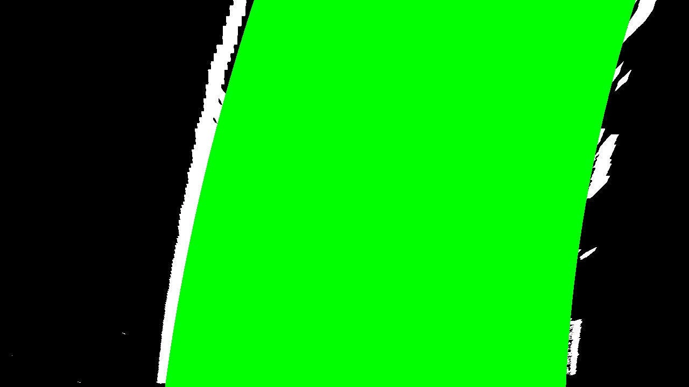 |


#### ClearImage
Make the image black. It does not remove extra information so after this you can draw in a black canvas.

```python
class ClearImage(ProcessStep):
    def __init__(self, **kwargs):
        super().__init__(**kwargs)
        self.setup(**kwargs)

    def setup(self, **kwargs):
        self.ready()

    @classmethod
    def from_params(cls):
        return cls()

    def process(self, img=None, **kwargs):
        self.check_ready()
        return np.zeros_like(img), kwargs
```

An example is:
<br>


#### CombineImages
Combine multiple images or in this case the output of multiple pipelines using weights.

```python
class CombineImages(ProcessStep):
    def __init__(self, **kwargs):
        super().__init__(**kwargs)
        self.pipelines = None
        self.weights = None
        if 'pipelines' in kwargs and 'weights'in kwargs:
            self.setup(**kwargs)

    def setup(self, **kwargs):
        self.pipelines = kwargs['pipelines']
        self.weights = kwargs['weights']
        self.ready()

    @classmethod
    def from_params(cls, pipelines, weights):
        return cls(pipelines=pipelines, weights=weights)

    def process(self, img=None, **kwargs):
        self.check_ready()
        combined = np.zeros_like(img)
        for pip, weight in zip(self.pipelines, self.weights):
            image, kwargs = pip.process(img, **kwargs)
            # cv2.addWeighted(combined, α, image, β, γ) -> combined * α + image * β + γ
            combined = cv2.addWeighted(combined, 1., image, weight, 0.)
        return combined, kwargs
```

An example is:
<br>

| Before 1      | Before 2     | After     |
|:---------------:|:---------------:|:---------------:|
|  |  | 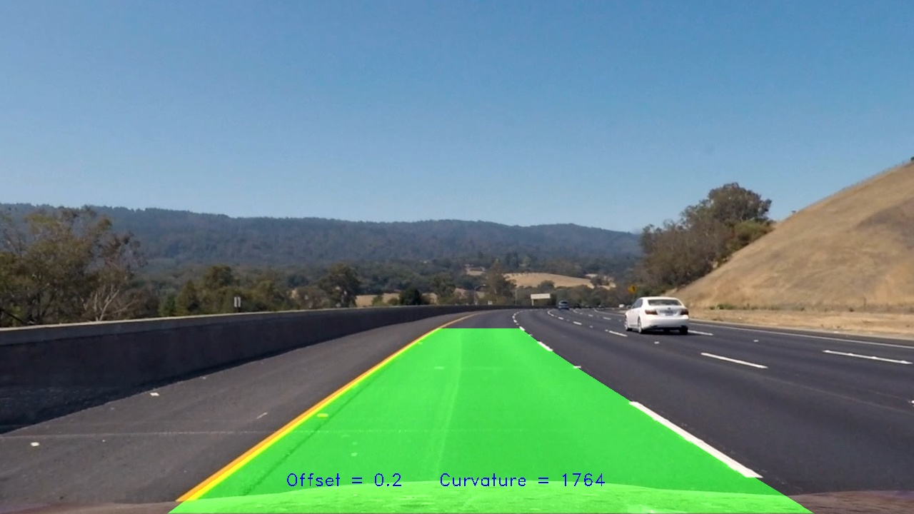 |


---
### Usage

In the code below you can see an example of the usage. The arguments passed to the pipeline are needed for different *steps*, for example, the directories and the name is used by a *step* to save intermediate images, or the type of the input is used by the lane lines finder.

```python
class LaneLinesFinderForFiles:
    def __init__(self):
        self.pipeline_factory = None
        self.pipeline = None

    def set_pipeline(self, pl):
        self.pipeline = pl

    def set_pipeline_factory(self, plf):
        self.pipeline_factory = plf
        self.reset_pipeline()

    def reset_pipeline(self):
        self.pipeline = self.pipeline_factory()

    def process_image(self, in_image, out_image):
        img = get_image(in_image)
        if img is not None:
            processed_img, _ = self.pipeline.process(img,
                                                  type='image',
                                                  file=pathlib.Path(in_image).name,
                                                  input_directory=pathlib.Path(in_image).parent,
                                                  output_directory=pathlib.Path(out_image).parent)
            save_image(processed_img, out_image)

    def process_images_directory(self, in_dir, out_dir):
        self.reset_pipeline()
        in_path = pathlib.Path(in_dir).resolve()
        out_path = pathlib.Path(out_dir).resolve()
        for f in in_path.glob('*'):
            self.process_image(str(f), str(out_path.joinpath(f.name)))

    def process_frame(self, img):
        processed_img, _ = self.pipeline.process(img, type='video',
                                                  file='',
                                                  input_directory='',
                                                  output_directory='')
        return processed_img

    def process_video(self, in_video, out_video):
        self.reset_pipeline()
        clip1 = VideoFileClip(in_video).subclip(3, 17)
        white_clip = clip1.fl_image(self.process_frame)  # NOTE: this function expects color images!!
        white_clip.write_videofile(out_video, audio=False)

    def process_videos_directory(self, in_dir, out_dir):
        in_path = pathlib.Path(in_dir).resolve()
        out_path = pathlib.Path(out_dir).resolve()
        for f in in_path.glob('*'):
            self.reset_pipeline()
            #try:
            self.process_video(str(f), str(out_path.joinpath(f.name)))
            #except:
            #    pass


if __name__ == '__main__':

    finder = LaneLinesFinderForFiles()

    finder.set_pipeline_factory(self_driving_car.pipeline)

    finder.process_images_directory('../test_images', '../test_images_output')
    finder.process_video('../test_videos/project_video.mp4', '../test_videos_output/project_video.mp4')
```
The output of this script is a bunch of processed images and a video.
<br>

##### Images

| Before      | After     |
|:---------------:|:---------------:|
|  | 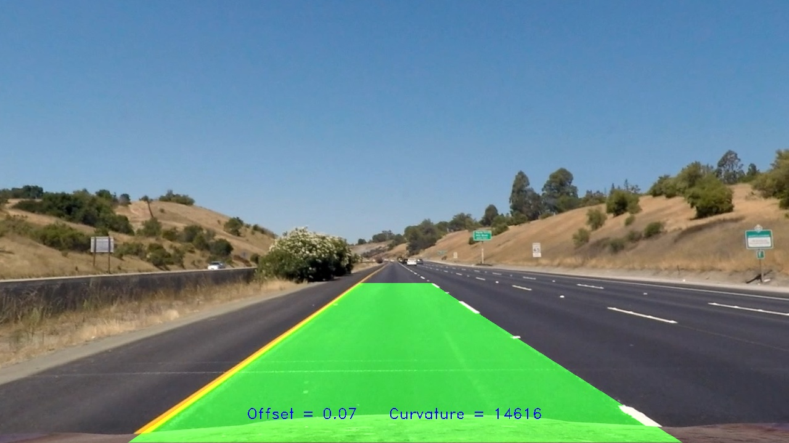 |
|  | 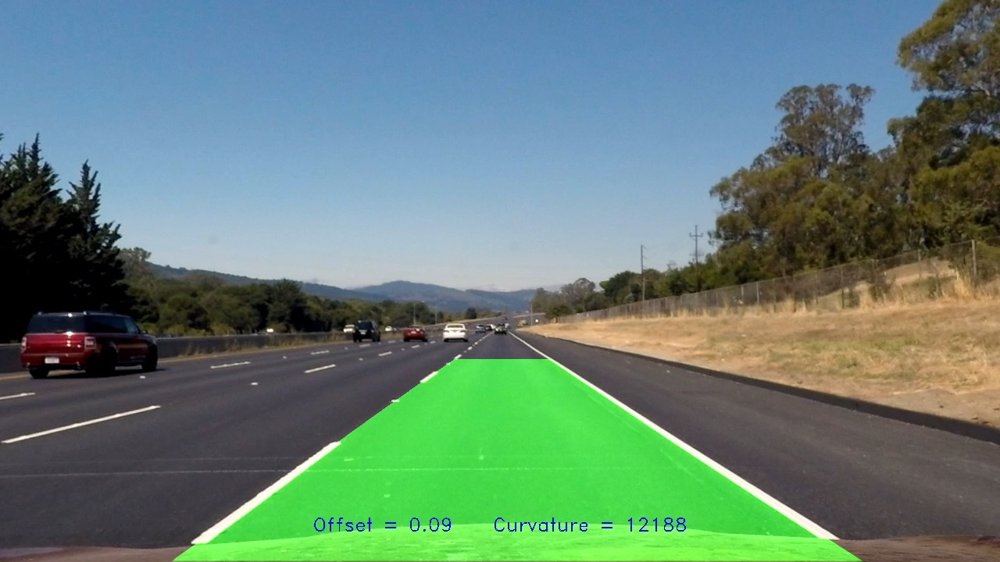 |
|  | 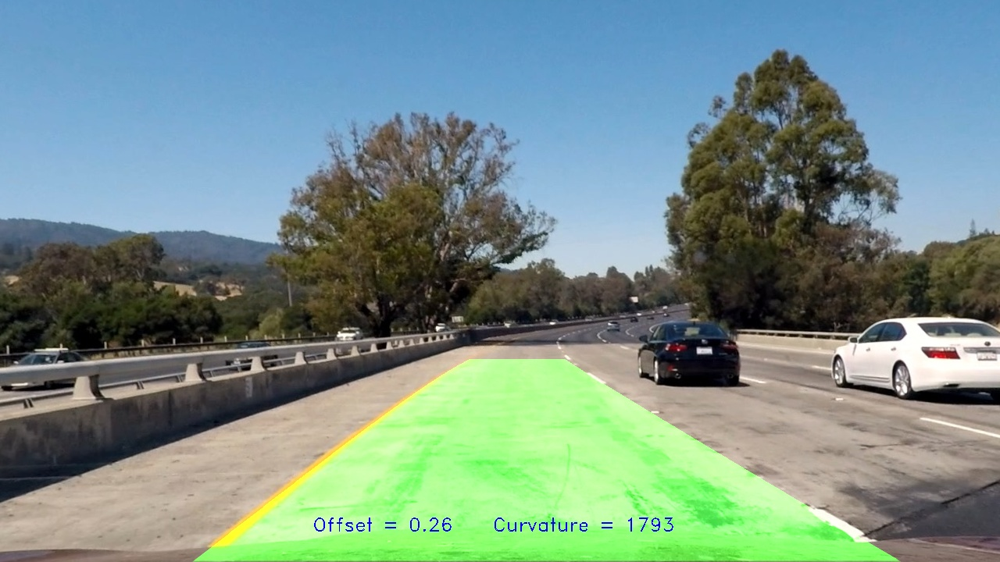 |
|  | 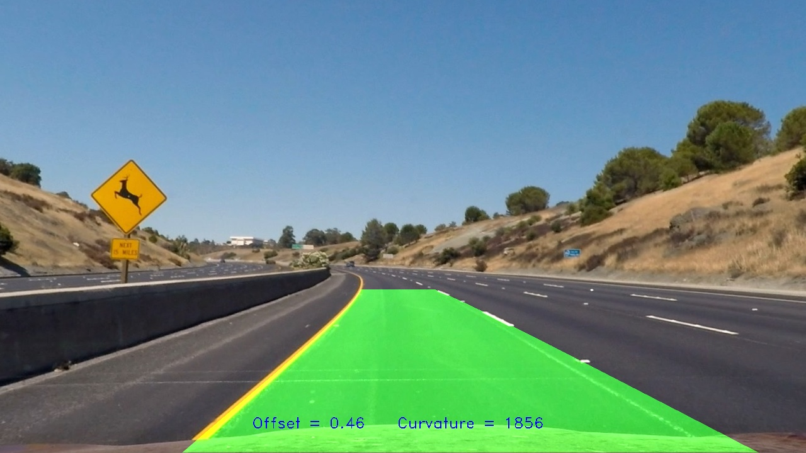 |
|  |  |
|  | 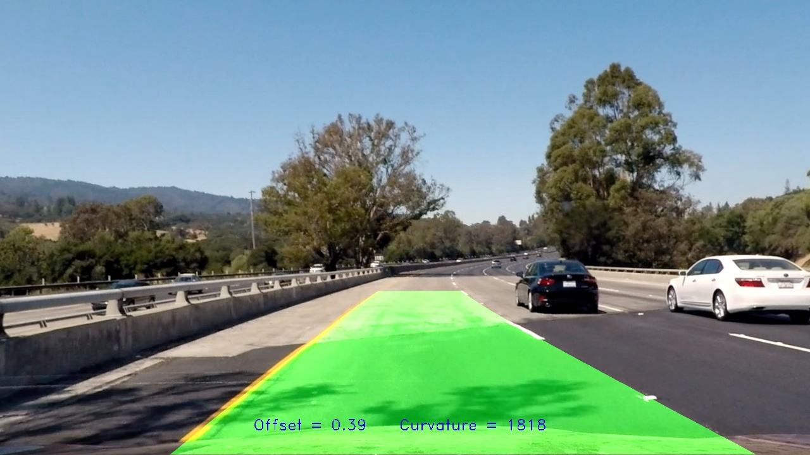 |
|  | 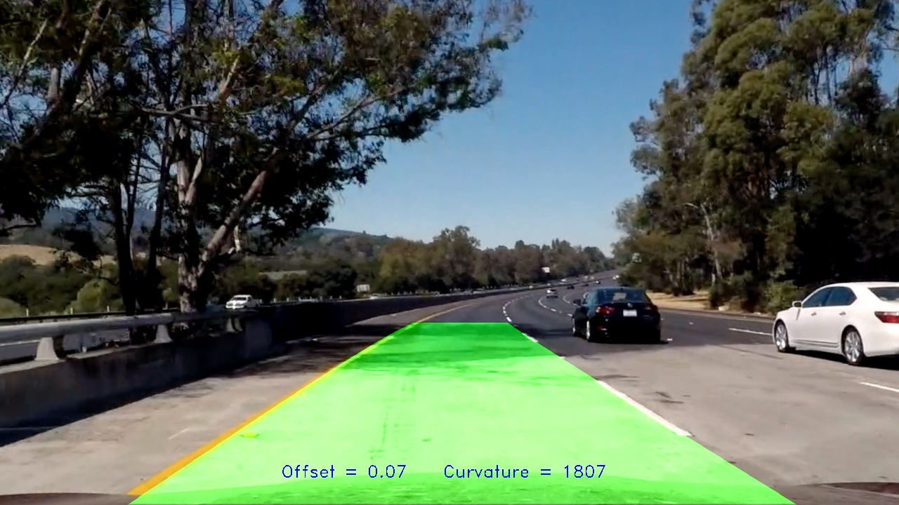 |
|  | 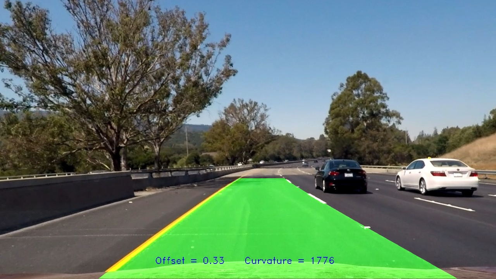 |


##### Video

<a href="http://www.youtube.com/watch?feature=player_embedded&v=UlJhgrs3FzY
"></a>


---
### Reflection

Possible weak points:

* It is very dependent of the parameters, for example the threshold limits.
* If you look far a head in the road, the image becomes not usable.
* Average a big number of lines may cause the system not to react in time, low number of lines may make the detector to flicker.
* The conversion from pixel to meters is very rough.

Future improvement that could be done:

* How I did the framework it would be very easy to implement new steps and add them so further calculations could be added easily.
* Tune the parameters and include more filters.
* Calibrate the conversion between pixels and meters.
